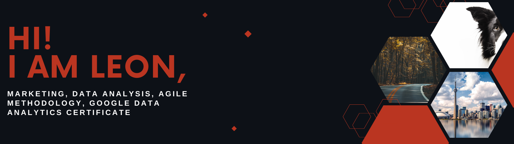

I am a professional with 9 years of experience in marketing, communication, branding and sales campaigns. I have experience managing squads using agile methodology.

Currently I am pursuing a 2-years course to gain knowledge in IT, such as project management, data analytics and web programming. So, coding is something new to me and I am still in the learning process, but you will find some of my portfolio.

I am also currently available to work and I can immediately can bring a lot of qualities

<h2 align="left">Qualities</h2>

🧠 Strategic thinking and business insights: In my previous experience as sales coordinator at Bayer, I was responsible for building and implementing sales campaigns. One of my roles was to anticipate customer needs considering the big picture and thinking strategically. To do so, I analyzed large data sets and identified trends and insights to take business decisions. I was always prepared understanding the business opportunities, anticipating, and having clarity around customer needs considering the big picture and thinking strategically.

👯 Project management experience: In my previous experience as a marketing sales coordinator at Bayer, I was recognized to led with purpose the project that we were launching at the time. As the right-hand to the Senior Manager, my role was to coordinate a cross-functional team inspiring the company to implement the area’s vision.
 
🤝 Building trust and being inclusive: Throughout my experiences, I’ve collaborated with different stakeholders creating an environment where new ideas and different opinions were welcome. By doing so, I created stronger relationships with senior level executives, peers and partners. I’ve worked on multiple projects at once and exceeded expectations in each of my roles.

 

<h2 align="left">How to reach me</h2>

&nbsp;&nbsp;&nbsp;
&nbsp;&nbsp;&nbsp;
&nbsp;&nbsp;&nbsp;
&nbsp;&nbsp;&nbsp;

 

<h2 align="left">I’m currently learning</h2>

 &nbsp;&nbsp;&nbsp;
 &nbsp;&nbsp;&nbsp;
 &nbsp;&nbsp;&nbsp;
 

<h2 align="left">Let's keep in touch! Follow me on Github and I will follow you back!</h2>

